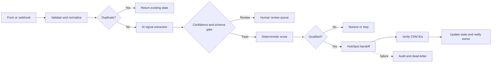

# AI Lead Qualification, CRM and Follow-Up System

[](https://github.com/aahil62/n8n-ai-lead-qualification-crm/actions/workflows/validate.yml)

Production-minded n8n lead qualification, HubSpot CRM handoff, follow-up and audit workflows. Qualifies inbound leads consistently, routes uncertain cases to review, and creates CRM records only after deterministic checks pass.

## Verified proof

| Evidence | Verified result |
|---|---|
| Runtime path | Representative end-to-end path passed |
| External systems | n8n, Airtable, HubSpot test account, Asana, and an OpenAI-compatible model endpoint |
| AI boundary | AI extracts structured buying signals; deterministic scoring and routing rules control CRM actions. |
| Duplicate behavior | Designed and fixture-covered; a public live duplicate-replay claim is not made. |
| Production boundary | Controlled test environment using fictional data |

A representative lead path passed through intake, AI signal extraction, deterministic scoring, Airtable state management, HubSpot contact/company/deal handling, and an Asana owner notification.

This is representative live-path evidence, not a claim that every production scenario has passed.

## Architecture



## Business process and reliability

- canonical input normalization and explicit validation
- idempotency or stable record mapping before side effects
- deterministic rules around irreversible business actions
- confidence and human-review gates where AI is used
- capped retries for transient failures
- audit records, dead-letter handling, and replay paths
- destination verification before a record is marked successful
- inactive workflow exports with credentials removed

## Test evidence

- [Test report](docs/test-report.md)
- [Test plan and remaining matrix](docs/test-plan.md)
- [Verification boundaries](docs/verification.md)

15 lead scenarios covering valid, duplicate, low-confidence, prompt-injection, CRM failure, and follow-up cases.

## Workflow package

| ID | Workflow | Responsibility |
|---|---|---|
| P1-01 | [`p1-lead-intake.json`](workflows/p1-lead-intake.json) | Form and webhook intake, canonical validation, deduplication |
| P1-02 | [`p1-qualification-core.json`](workflows/p1-qualification-core.json) | AI signal extraction, schema/confidence gate, deterministic scoring |
| P1-03 | [`p1-crm-handoff.json`](workflows/p1-crm-handoff.json) | HubSpot upsert, ID verification, owner notification, failure paths |
| P1-04 | [`p1-follow-up-sweeper.json`](workflows/p1-follow-up-sweeper.json) | Scheduled follow-up reminders without duplicate alerts |
| P1-05 | [`p1-weekly-pipeline-report.json`](workflows/p1-weekly-pipeline-report.json) | Deterministic pipeline aggregates and weekly delivery |
| P0-99 | [`shared-error-handler.json`](workflows/shared-error-handler.json) | Shared audit, alert, redaction, and dead-letter handling |


## Model-provider status

| Provider | Status |
|---|---|
| Groq-hosted OpenAI-compatible endpoint | Representative live path verified |
| OpenAI | Architecture-compatible; test before claiming verified |
| Anthropic/Claude | Not verified in this package |


## Known limit

The remaining replay, malformed-input, rate-limit, and notification-failure matrix is documented but has not been run live as a complete production gate.

## Review the repository

- [Architecture](docs/architecture.md)
- [Data contract](docs/data-contract.md)
- [Setup guide](docs/setup.md)
- [Placeholder map](docs/placeholder-map.md)
- [Test plan](docs/test-plan.md)
- [Test report](docs/test-report.md)
- [Verification and limitations](docs/verification.md)
- [Sanitized fixtures](fixtures)
- [Configuration samples](config)
- [Repository usage terms](USAGE.md)


## Import and test

1. Import `workflows/shared-error-handler.json` into a test n8n instance.
2. Import the project workflows.
3. Follow [the placeholder map](docs/placeholder-map.md) and reconnect sub-workflow IDs.
4. Create credentials inside n8n. Do not place secrets in workflow JSON.
5. Validate every workflow and keep it inactive.
6. Run the fixtures against disposable accounts before enabling schedules or webhooks.

Run the repository check locally:

```bash
node scripts/validate-repository.mjs
```

## Portfolio context

This repository is a sanitized engineering case study by [Aahil Sayed](https://github.com/aahil62). It is designed to show workflow architecture, reliability decisions, test coverage, and reusable integration patterns. Client deployments still require account-specific field mapping, credentials, acceptance criteria, and production testing.
